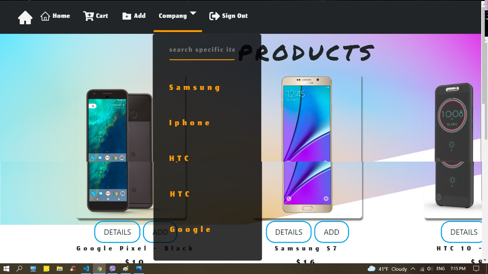
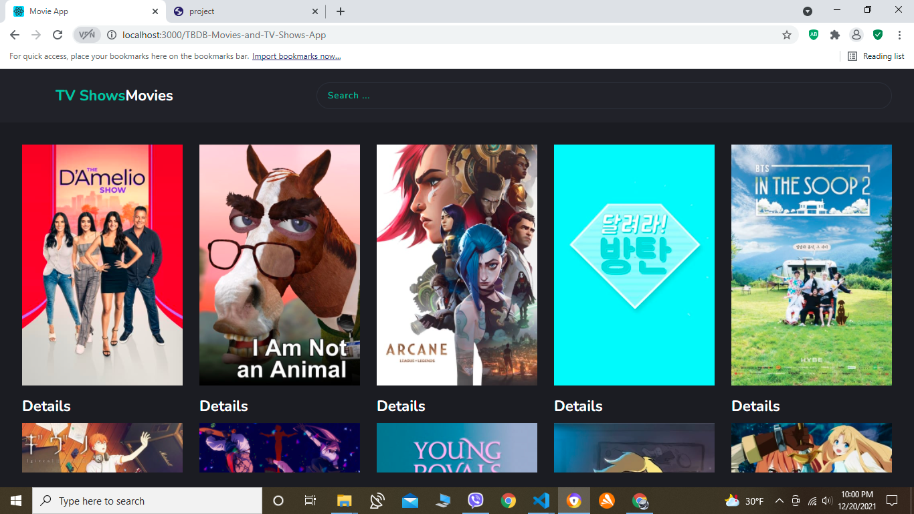
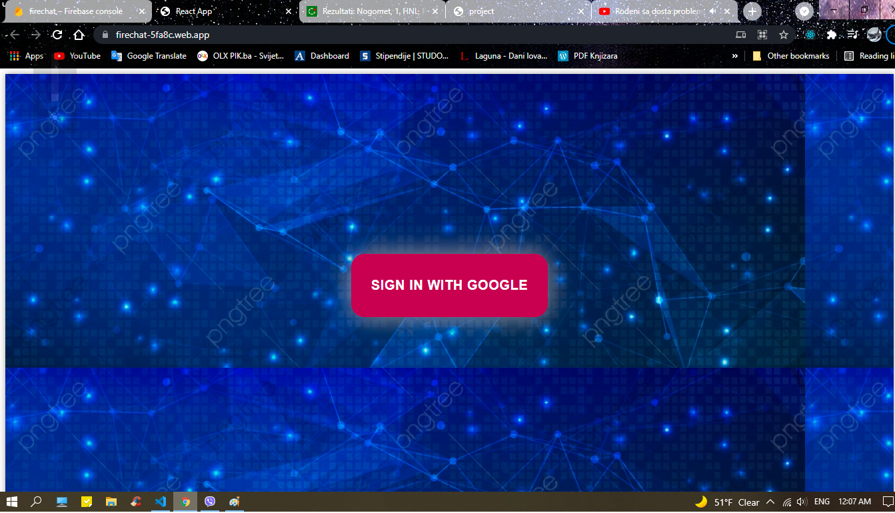
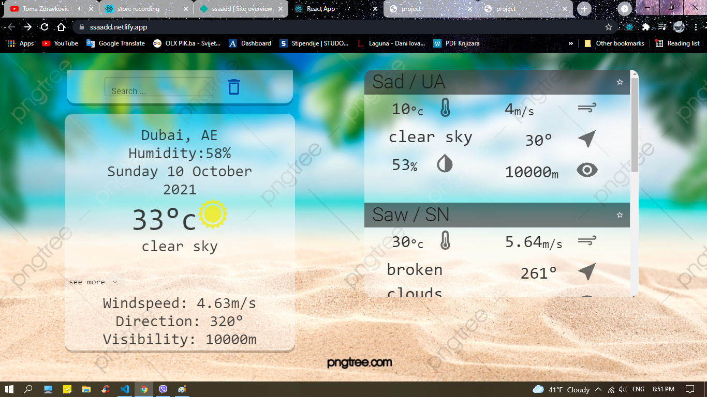

### Hi there 👋, my name is Sanel
#### I am Web Developing Enthusiast
Hello,  I'm a self-taught React developer and QA engineer who is ready and decisive to study...

Skills:  REACT / JS / HTML / CSS / QA

- 🌱 I’m currently learning QA, REACT and JS 

  
  

                              
        
                                

                                    

    

