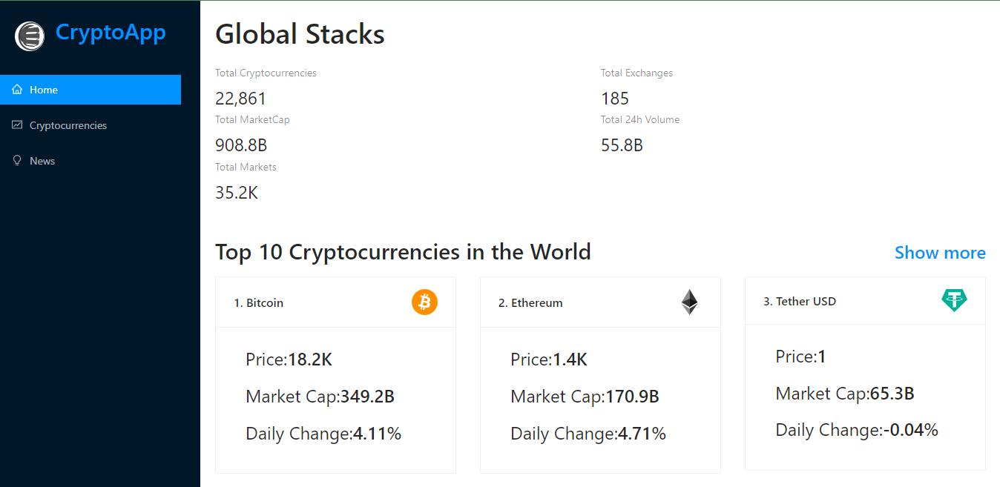

### Hi there 👋, my name is Sanel
#### I am Web Developing Enthusiast
Hello,  I'm a self-taught React developer and QA engineer who is ready and decisive to study...

Skills:  REACT / JS / HTML / CSS / QA

- 🌱 I’m currently learning QA, REACT and JS 
                           

### My portfolio
   
### Skills
   	 	   

### Check out my projects, just click on them.

                                
     
     
    
  

  

